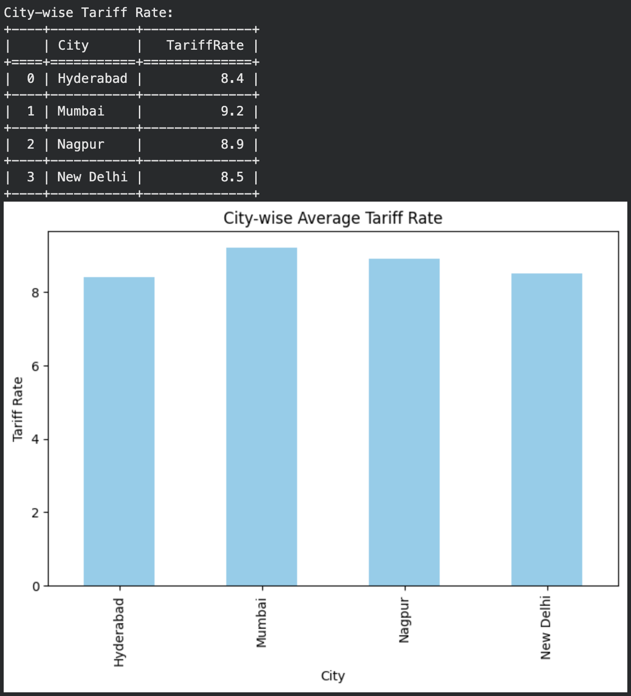
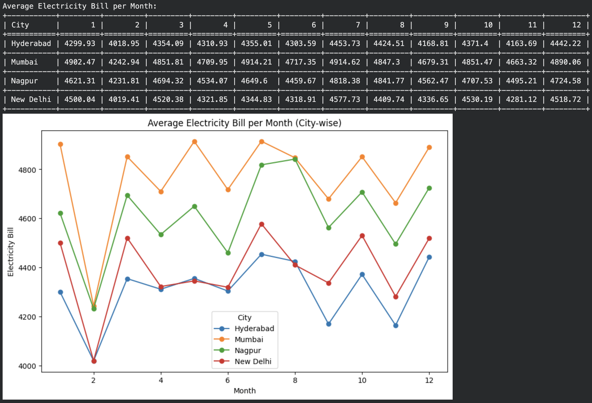
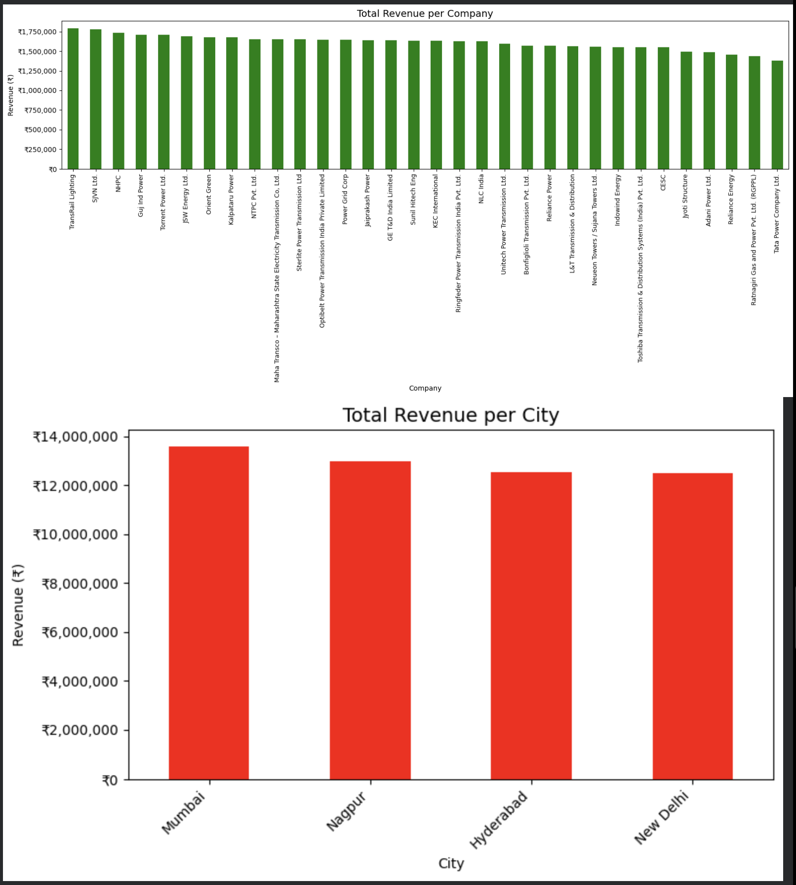
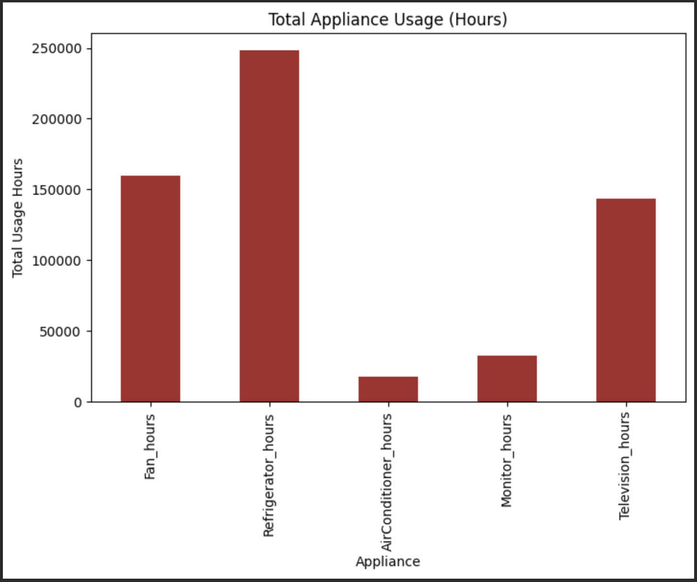
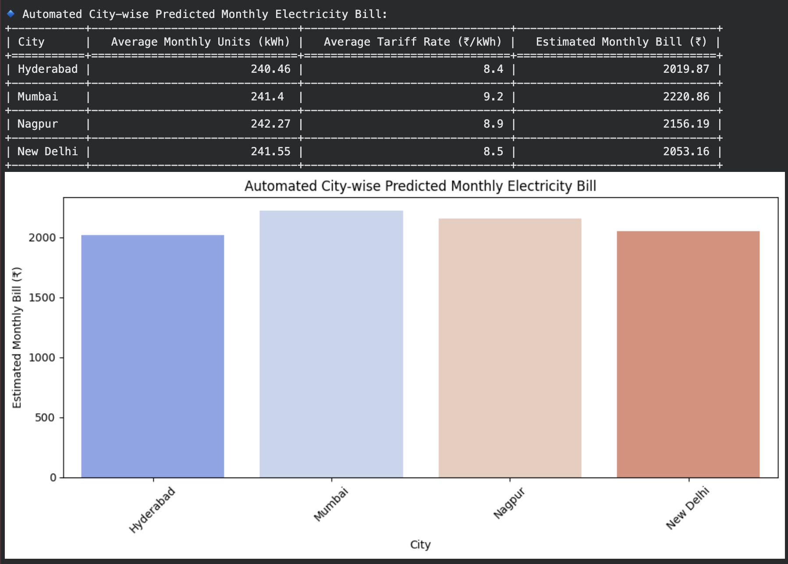
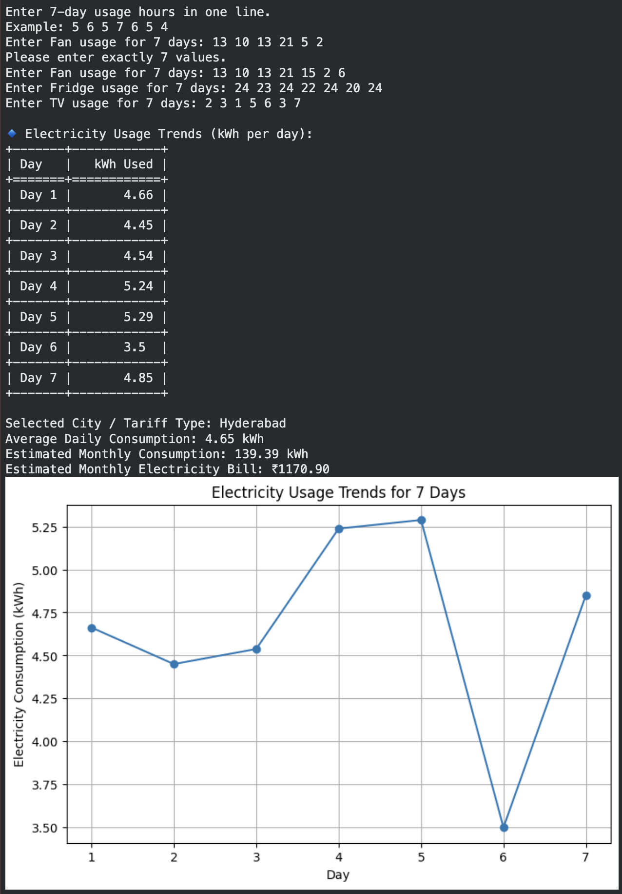

# HouseHold Electricity Analysis


A Python-based analysis of electricity consumption across four cities — exploring tariff rates, monthly bills, appliance-level usage, and company revenue, then estimating monthly electricity bills both automatically (city averages) and interactively (based on a user's own appliance usage).

---

## Table of Contents

- [Project Overview](#project-overview)
- [Analytical Objectives](#analytical-objectives)
- [Tools & Technologies](#tools--technologies)
- [Dataset](#dataset)
- [Project Structure](#project-structure)
- [Features](#features)
- [Sample Outputs](#sample-outputs)
- [Setup & How to Run](#setup--how-to-run)
- [Sample Insights](#sample-insights)
- [Limitations](#limitations)
- [Future Improvements](#future-improvements)
- [Author](#author)

---

## Project Overview

This project analyzes electricity usage data across four cities to uncover patterns in tariff rates, monthly billing, appliance-level consumption, and company-wise revenue. It also includes two bill-estimation tools: one that projects an average monthly bill per city from historical appliance usage, and an interactive command-line tool that estimates a bill from a user's own 7-day appliance usage input.

## Analytical Objectives

The analysis aims to answer:

- How does the average tariff rate vary by city and by company?
- How does the average electricity bill change month to month, per city?
- Which city has the highest average monthly consumption?
- How do total usage hours vary by company across the year?
- Which companies and cities generate the most total electricity revenue?
- Which appliances contribute the most total usage hours?
- Given a city's average appliance usage and tariff rate, what's the estimated monthly bill?
- Given a user's own appliance usage over 7 days, what's their estimated monthly bill?

## Tools & Technologies

- **Python** - 3.13.15
- **pandas**, **numpy** — data loading, cleaning, aggregation
- **matplotlib**, **seaborn** — visualizations
- **tabulate** — formatted console output for all summary tables

## Dataset

`Electricity_dataset(4cities).csv` — electricity usage records across 4 cities, including:

| Column | Description |
|---|---|
| `City` | City where usage was recorded |
| `Company` | Electricity provider/company |
| `Months` | Month of the record |
| `TariffRate` | Tariff rate (₹ per kWh) |
| `ElectricityBill` | Billed amount |
| `MonthlyHours` | Total monthly usage hours |
| `Fan_hours`, `Refrigerator_hours`, `AirConditioner_hours`, `Monitor_hours`, `Television_hours` | Per-appliance daily/monthly usage hours |

*(Column list inferred from the script — update this table if your actual CSV headers differ.)*

> **Note:** The `Data/` folder contains two CSVs — `Electricity_dataset(4cities).csv` and `electricity_bill_dataset.csv`. Only `Electricity_dataset(4cities).csv` is used by `Electricity_Analysis.py`. If `electricity_bill_dataset.csv` is a separate/earlier dataset, document its purpose here or remove it if unused.

## Project Structure

```text
HouseHold-Electricity-Analysis/
│
├── Data/
│   ├── Electricity_dataset(4cities).csv
│   └── electricity_bill_dataset.csv
│
├── Images/
│   ├── city_wise_tariff.png
│   ├── avg_bill_per_month.png
│   ├── total_revenue.png
│   ├── total_appliance_usage.png
│   ├── automated_bill_prediction.png
│   └── user_input_usage_demo.png
│
├── .gitignore
├── Electricity_Analysis.py
└── README.md
```

> **Important:** `Electricity_Analysis.py` currently reads the CSV with `pd.read_csv('Electricity_dataset(4cities).csv')` — a relative path with no folder prefix. Since the file actually lives in `Data/`, update that line to:
> ```python
> df = pd.read_csv('Data/Electricity_dataset(4cities).csv')
> ```
> otherwise the script will only run correctly if executed from inside the `Data/` folder.

## Features

The script runs a sequence of analysis functions, each printing a formatted table and rendering a chart:

| Function | What it does |
|---|---|
| `show_original_data()` | Previews the first rows of the raw dataset |
| `city_wise_tariff()` | Average tariff rate per city — bar chart |
| `avg_bill_per_month()` | Average electricity bill per month, per city — multi-line chart |
| `avg_monthly_consumption()` | Average monthly consumption (hours) per city — bar chart |
| `total_monthly_hours_per_company()` | Total monthly usage hours per company, plotted in a dynamic subplot grid (one line chart per company) |
| `total_revenue()` | Total revenue by company and by city, formatted in ₹ — side-by-side bar charts |
| `avg_tariff_by_company()` | Average tariff rate per company — bar chart |
| `total_appliance_usage()` | Total usage hours across all appliance types — bar chart |
| `automated_electricity_bill_prediction()` | Estimates each city's average monthly bill from average appliance usage × wattage-to-kWh conversion × average tariff rate — bar chart |
| `user_input_usage_analysis()` | Interactive CLI: choose a city (or custom tariff), select which appliances you use (or add custom ones), enter 7 days of usage hours, and get a daily/weekly/monthly kWh breakdown plus an estimated bill — line chart of the 7-day trend |

## Sample Outputs

Actual output from running the script on the dataset:

**City-wise average tariff rate**



*Mumbai has the highest average tariff at ₹9.2/kWh, followed by Nagpur (₹8.9), New Delhi (₹8.5), and Hyderabad (₹8.4).*

**Average electricity bill per month, by city**



*Mumbai consistently shows the highest average monthly bill across the year, while Hyderabad stays lowest. All four cities show a sharp dip in February.*

**Total revenue by company and by city**



*TransRail Lighting leads all companies in total revenue. At the city level, Mumbai generates the most total revenue (~₹13.6M), followed by Nagpur, Hyderabad, and New Delhi.*

**Total appliance usage hours**



*Refrigerators account for the most total usage hours (~248,000), well ahead of fans (~160,000) and televisions (~143,000) — air conditioners see the least usage overall (~18,000 hours), reflecting the "always-on" nature of refrigeration versus intermittent AC use.*

**Automated city-wise predicted monthly bill**



*Mumbai has the highest estimated average monthly bill (₹2,220.86), consistent with it also having the highest tariff rate. Hyderabad has the lowest at ₹2,019.87.*

**Interactive bill estimator — example run**



*Example session: a user in Hyderabad enters 7 days of Fan, Fridge, and TV usage. The tool computes daily kWh, a 7-day trend chart, and an estimated monthly bill (₹1,170.90 in this example).*

## Setup & How to Run

**Prerequisites**
- Python 3.13.15
- Install dependencies:
  ```bash
  pip install pandas numpy matplotlib seaborn tabulate
  ```

**Steps**

1. Place `Electricity_dataset(4cities).csv` in the same directory as the script (or update the path in `pd.read_csv(...)` to match your `data/` folder).
2. Run the script:
   ```bash
   python Electricity_Analysis.py
   ```
3. The script runs all analysis functions in sequence, each opening a matplotlib chart window — **close each chart to continue** to the next function, since `plt.show()` blocks execution.
4. At the end, it launches the **interactive bill estimator** in the terminal: select a city (or enter a custom tariff), choose which appliances you use, optionally add custom appliances, then enter 7 days of usage hours per appliance to get a personalized estimate.

### Running on Google Colab

No local Python setup? Run it directly in [Google Colab](https://colab.research.google.com):

1. **Install the one missing dependency** — Colab has pandas, numpy, matplotlib, and seaborn preinstalled, but not `tabulate`:
   ```python
   !pip install tabulate
   ```
2. **Upload the dataset.** Either:
   - Drag-and-drop upload:
     ```python
     from google.colab import files
     uploaded = files.upload()  # select Electricity_dataset(4cities).csv when prompted
     ```
   - Or mount Google Drive and point `pd.read_csv(...)` at the file's Drive path:
     ```python
     from google.colab import drive
     drive.mount('/content/drive')
     ```
3. **Paste the script into a cell** (or upload the `.py` file and run it with `%run Electricity_Analysis.py`).
4. **Run the cell.** Charts render inline automatically in Colab — you won't need to close chart windows to proceed, unlike running it locally in a terminal.
5. **For the interactive `user_input_usage_analysis()` step**, Colab supports `input()` — a text box appears below the running cell for each prompt. Type your answer and press Enter to continue.

## Sample Insights

| Insight Area | Finding |
|---|---|
| Highest average tariff rate | **Mumbai** — ₹9.2/kWh, vs. Nagpur (₹8.9), New Delhi (₹8.5), and Hyderabad (₹8.4, the lowest) |
| Highest average monthly bill | **Mumbai** consistently bills highest across all 12 months; **Hyderabad** consistently lowest |
| Top company by revenue | **TransRail Lighting** leads all companies in total revenue |
| Top city by revenue | **Mumbai** (~₹13.6M total), followed by Nagpur, Hyderabad, and New Delhi (all ~₹12.5M) |
| Highest-usage appliance | **Refrigerators** — ~248,000 total hours, far ahead of Fans (~160,000) and Televisions (~143,000); Air Conditioners lowest (~18,000) |
| City with highest predicted bill | **Mumbai** — ₹2,220.86 estimated monthly bill, tracking its higher tariff rate; Hyderabad lowest at ₹2,019.87 |

> All figures above are pulled directly from actual script output (see [Sample Outputs](#sample-outputs)) — not placeholders.

## Limitations

- `automated_electricity_bill_prediction()` is a **deterministic formula-based estimate** (average appliance hours × fixed wattage assumptions × average tariff), not a trained machine learning model — worth noting since "prediction" can imply ML. It's closer to a rule-based calculator than a statistical forecast.
- Appliance wattage values are fixed constants (e.g., AC = 1500W, Fan = 62.5W) rather than derived from the dataset, so estimates assume typical appliance specs rather than the household's actual devices.
- The interactive tool assumes a consistent 7-day usage pattern is representative of a full month (`avg_daily_kWh × 30`), which may not hold for households with irregular usage.

## Future Improvements

- Replace the formula-based estimator with a trained regression model (e.g., Linear Regression on historical `ElectricityBill` vs. appliance usage) for a true predictive model.
- Export charts to image files instead of interactive `plt.show()` windows, for easier sharing and reproducibility.
- Add command-line arguments so individual analyses can be run without executing the entire script.
- Add input validation/unit tests for the interactive usage-analysis tool.
- Build a simple web dashboard (e.g., Streamlit) version for non-technical users to explore the data and run the bill estimator without the terminal.

## Author

**Soumil Jain**

A Python data analysis and estimation project exploring electricity consumption, tariffs, and billing patterns across four cities.
